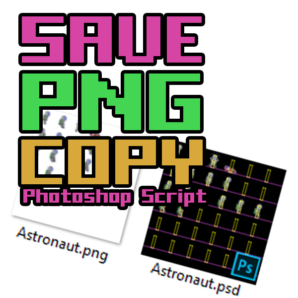
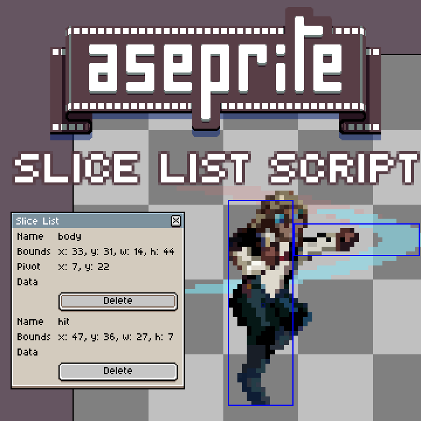

# DevTools
A collection of scripts and tools for developers categorized by application
by Jonathan Smårs / jsmars@gmail.com

I'm a solo indie game dev posting projects and dev updates on twitter [@jsmars](https://twitter.com/jsmars) and [jsmars.com](http://jsmars.com/) 

## Photoshop Scripts

### savePngCopy.js
This script will save an extra PNG file in the same directory when saving as PSD,
Also, any layers containing HIDE in their name will be hidden for the PNG file, use this for backgrounds, helpers, etc
To enable, go to File-Scripts-Scripts Event Manager, Enable scripts and add this script on "Save Document"
In addition, any layer (or folder) containing .png, will be saved out as a seperate file with that exact name.

## Aseprite Scripts

### sliceList.lua
This script creates a handy little list of all the slices in your document and allows you to delete them since Aseprite doesn't provide a list like this and can sometimes create corrupt slices that do not show up in the view.

